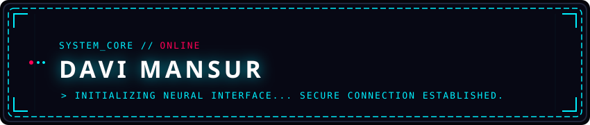

  

<!-- Typing Animation / Header de Apresentação -->

  

  
  
  

---

## ⚡ // SYSTEM_OVERVIEW

<table width="100%">
  <tr>
    <td width="55%" valign="top">
      <h3>&gt; IDENTIFICAÇÃO DO NÚCLEO</h3>
      
Bem-vindo ao meu terminal de desenvolvimento. Sou focado em criar novos projetos e aprender o que precisar para desenvolver mais meus conhecimentos na área

      <ul>
        <li>📍 <b>Localização:</b> Belo horizonte // Brasil </li>
        <li>🎯 <b>Missão:</b> Aprender e Melhorar meus conhecimentos nessa área e realizar projetos de verdade</li>
      </ul>
    </td>
    <td width="45%" valign="top" align="center">
       
      
    </td>
  </tr>
</table>

---

## 🛠️ // TECH_STACK_MATRIX

  <i>Linguagens, e Conhecimentos:</i>

 

### 💻 Linguagens

### 🌐 Frontend

### ⚙️ Banco de Dados

---

## 🚀 // FEATURED_PROJECTS

<table width="100%">
  <tr>
    <td width="50%" align="center">
      
    </td>
    <td width="50%" align="center">
      
    </td>
  </tr>
</table>

---

